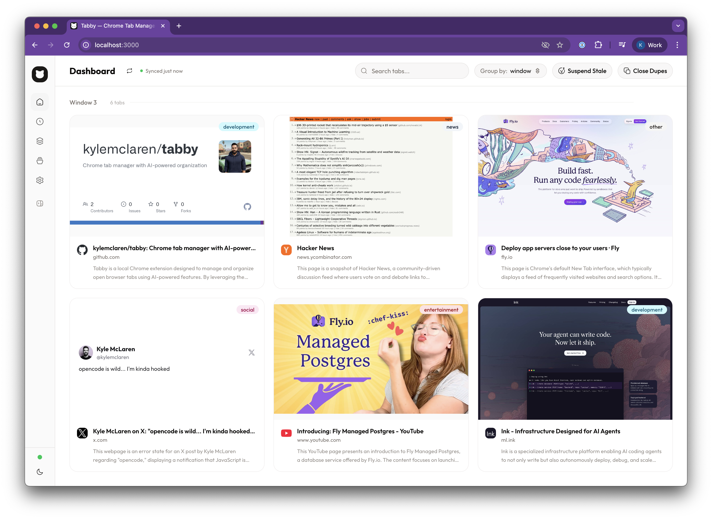

<div align="center">

# Tabby

**Chrome tab manager with AI-powered organization**

Auto-discovers open tabs via the Chrome DevTools Protocol, saves browsing sessions, and uses Ollama for classification, summarization, and smart grouping.

<picture>
  <source media="(prefers-color-scheme: dark)" srcset="docs/dark-mode.png">
  <source media="(prefers-color-scheme: light)" srcset="docs/light-mode.png">
  
</picture>

<br>

<sub>Light and dark mode with live tab previews, AI classification, and window grouping</sub>

</div>

<br>

## Features

- **Auto-sync** — Polls Chrome every 30s via WebSocket CDP, tracks tab lifecycle with full history
- **Tab management** — Focus, close, reopen tabs directly from the UI
- **Window grouping** — Tabs grouped by Chrome window with renamable window labels
- **Sessions** — Save, restore, import/export browsing session snapshots. Auto-saves "Latest" on every sync
- **Groups** — Organize tabs into named collections, manually or via AI suggestions
- **AI classification** — Auto-categorize tabs (work, social, dev, news, etc.) with article detection
- **AI summarization** — Generate page summaries, auto-summarize articles on sync
- **Reader mode** — Distraction-free article reader for long-form content
- **Duplicate detection** — Find and close duplicate tabs across windows
- **Stale tab detection** — Identify and suspend tabs inactive for 24+ hours
- **OG image enrichment** — Auto-fetch preview images for YouTube, Twitter, LinkedIn, etc.
- **Tweet extraction** — Fetch tweet content and author info for Twitter/X tabs
- **Screenshots** — Capture tab screenshots via CDP with 5-minute caching
- **Command palette** — `Cmd+K` to search tabs, history, sessions, groups, and run actions
- **Dark mode** — System-aware theme with toggle

## Tech Stack

| Layer | Technology |
|-------|-----------|
| Framework | Next.js 16 (App Router, Turbopack) |
| UI | shadcn/ui v4 (Base UI + Tailwind v4) |
| Icons | Hugeicons |
| Database | SQLite via Drizzle ORM + `bun:sqlite` |
| Chrome | DevTools Protocol over WebSocket |
| AI | Ollama (local inference) |
| Runtime | Bun |
| Deployment | Docker + nginx reverse proxy |

## Quick Start

### 1. Enable Chrome Remote Debugging

In your normal Chrome — no restart, no separate profile, no flags needed:

1. Navigate to `chrome://inspect/#remote-debugging`
2. Enable remote debugging and allow connections

Chrome writes a `DevToolsActivePort` file that Tabby reads to connect via WebSocket.

### 2. Run with Docker

```bash
docker compose up --build
```

For live-reloading during development:

```bash
docker compose watch
```

### 3. Run natively

```bash
bun install
bun dev
```

Open [http://localhost:3000](http://localhost:3000). Tabs sync automatically within 30 seconds.

## Architecture

### Chrome Connection

Tabby uses the [Chrome DevTools Protocol](https://chromedevtools.github.io/devtools-protocol/) over WebSocket — the same mechanism used by [chrome-devtools-mcp](https://github.com/ChromeDevTools/chrome-devtools-mcp).

When remote debugging is enabled via `chrome://inspect/#remote-debugging`, Chrome writes a `DevToolsActivePort` file to its profile directory containing the port and WebSocket path. Tabby reads this file and maintains a persistent WebSocket connection for tab management.

CDP commands used:
- `Target.getTargets` — list all tabs
- `Target.activateTarget` — focus a tab
- `Target.closeTarget` — close a tab
- `Target.createTarget` — open a new tab
- `Target.attachToTarget` + `Page.captureScreenshot` — capture screenshots
- `Browser.getVersion` — connection health check
- `Browser.getWindowForTarget` — map tabs to windows

### Why nginx in Docker?

Chrome validates the `Host` header on WebSocket upgrade requests and silently drops connections from non-localhost origins. When Tabby runs in Docker, it reaches Chrome via `host.docker.internal` — Chrome rejects this.

The nginx sidecar proxies WebSocket connections from the container to Chrome on the host, rewriting the `Host` header to `localhost:9222`. This is required for Docker; not needed when running natively.

### Sync Flow

Every 30 seconds:
1. Poll Chrome tabs via CDP `Target.getTargets`
2. Diff against database — add new tabs, update existing, mark closed
3. Enrich special domains (OG images for YouTube/LinkedIn, tweet data for Twitter/X)
4. Update the auto-saved "Latest" session
5. Auto-classify and auto-summarize new tabs via Ollama (background, non-blocking)

### Database

SQLite with WAL mode, managed via Drizzle ORM. Tables auto-created on startup.

| Table | Purpose |
|-------|---------|
| `tabs` | All tabs (open + closed history) with metadata, category, summary |
| `groups` | Named tab collections |
| `tabs_to_groups` | Many-to-many join (cascade delete) |
| `sessions` | Session snapshots (auto + manual) |
| `session_tabs` | Tabs within sessions (copies, not references) |
| `settings` | Key-value store (window names, etc.) |

### Ollama (optional)

All AI features require a local [Ollama](https://ollama.com) instance. The app works fully without it — AI buttons are disabled when Ollama is unreachable.

AI capabilities:
- **Classification** — Categorizes tabs into 10 categories + detects readable articles
- **Summarization** — 2-3 sentence summaries from page content
- **Group suggestions** — Proposes logical tab groupings based on content similarity
- **Auto-processing** — Classifies and summarizes new tabs after each sync (background)

## API Reference

### Tabs

| Method | Path | Description |
|--------|------|-------------|
| GET | `/api/tabs` | List tabs (filter: `status`, `category`, `search`) |
| PATCH | `/api/tabs/[tabId]` | Update tab metadata |
| DELETE | `/api/tabs/[tabId]` | Delete tab from database |
| POST | `/api/tabs/sync` | Trigger Chrome sync |
| POST | `/api/tabs/bulk` | Bulk close or delete (`{ tabIds, action }`) |
| GET | `/api/tabs/stale` | Find tabs inactive for N hours |
| POST | `/api/tabs/stale` | Close stale tabs |
| GET | `/api/tabs/[tabId]/reader` | Fetch article content |
| GET | `/api/tabs/[tabId]/screenshot` | Capture/retrieve tab screenshot |

### Chrome

| Method | Path | Description |
|--------|------|-------------|
| GET | `/api/chrome/status` | Connection status + browser version |
| POST | `/api/chrome/focus` | Focus tab in Chrome |
| POST | `/api/chrome/close` | Close tab in Chrome |
| POST | `/api/chrome/open` | Open URL in Chrome |
| GET | `/api/chrome/close-duplicates` | Detect duplicate tabs |
| POST | `/api/chrome/close-duplicates` | Close duplicate tabs |

### Sessions

| Method | Path | Description |
|--------|------|-------------|
| GET | `/api/sessions` | List all sessions |
| POST | `/api/sessions` | Save current tabs as named session |
| GET | `/api/sessions/[id]` | Get session with tabs |
| PATCH | `/api/sessions/[id]` | Rename session |
| DELETE | `/api/sessions/[id]` | Delete session |
| POST | `/api/sessions/[id]/restore` | Restore all tabs to Chrome |
| GET | `/api/sessions/[id]/export` | Download as JSON |
| POST | `/api/sessions/import` | Import from JSON |

### Groups

| Method | Path | Description |
|--------|------|-------------|
| GET | `/api/groups` | List groups with tab counts |
| POST | `/api/groups` | Create group |
| PATCH | `/api/groups/[id]` | Update group |
| DELETE | `/api/groups/[id]` | Delete group |
| GET | `/api/groups/[id]/tabs` | Get tabs in group |
| POST | `/api/groups/[id]/tabs` | Add/remove tabs |

### AI

| Method | Path | Description |
|--------|------|-------------|
| GET | `/api/ai/status` | Ollama connection + available models |
| POST | `/api/ai/classify` | Classify tabs into categories |
| POST | `/api/ai/summarize` | Summarize tab content |
| POST | `/api/ai/suggest-groups` | AI-powered group suggestions |

### Settings

| Method | Path | Description |
|--------|------|-------------|
| GET | `/api/window-names` | Get custom window names |
| PUT | `/api/window-names` | Set/clear window name |

## Session Export Format

```json
{
  "version": 1,
  "exportedAt": "2026-03-15T12:00:00.000Z",
  "session": {
    "name": "Work tabs Friday",
    "createdAt": "2026-03-15T10:00:00.000Z",
    "tabs": [
      {
        "url": "https://example.com",
        "title": "Example",
        "domain": "example.com",
        "faviconUrl": null,
        "category": "work",
        "position": 0
      }
    ]
  }
}
```

Import validates: version 1, non-empty name, non-empty tabs, valid URLs (blocks `javascript:`, `data:`, `vbscript:`), max 1000 tabs.

## Environment Variables

| Variable | Default | Description |
|----------|---------|-------------|
| `DATABASE_PATH` | `./data/tabby.db` | SQLite database location |
| `DEVTOOLS_PORT_FILE` | `~/Library/.../DevToolsActivePort` | Chrome debug port file |
| `CHROME_WS_HOST` | `127.0.0.1` | WebSocket host (`chrome-proxy` in Docker) |
| `CHROME_PROFILE_DIR` | `~/Library/.../Google/Chrome` | Chrome profile directory |
| `OLLAMA_URL` | `http://localhost:11434` | Ollama API endpoint |
| `OLLAMA_MODEL` | `qwen3.5:latest` | Model for AI features |

## Keyboard Shortcuts

| Shortcut | Action |
|----------|--------|
| `Cmd+K` | Open command palette |
| `Cmd+S` | Quick-save current session |
| `Cmd+B` | Toggle sidebar |
| `D` | Toggle dark/light theme |

## Project Structure

```
tabby/
├── app/
│   ├── page.tsx                    # Dashboard
│   ├── history/page.tsx            # Closed tabs history
│   ├── sessions/page.tsx           # Session management
│   ├── groups/page.tsx             # Group management
│   ├── settings/page.tsx           # Configuration
│   └── api/                        # 25 API endpoints
├── components/
│   ├── tabs/                       # Tab UI (cards, grid, detail, reader)
│   ├── sessions/                   # Session UI (cards, dialogs)
│   ├── groups/                     # Group UI (cards, dialogs, AI suggest)
│   ├── layout/                     # App shell, sidebar, header
│   ├── shared/                     # Favicon, category badge, empty state
│   ├── providers/                  # Sync + theme context providers
│   ├── ui/                         # shadcn/ui components
│   └── command-palette.tsx         # Cmd+K palette
├── lib/
│   ├── chrome/cdp.ts               # Chrome DevTools Protocol client
│   ├── chrome/sync.ts              # Tab sync logic
│   ├── db/schema.ts                # Drizzle ORM schema
│   ├── db/index.ts                 # Database connection
│   ├── sessions/auto-save.ts       # Auto-save "Latest" session
│   ├── ai/auto-process.ts          # Background AI processing
│   ├── ollama.ts                   # Ollama API client
│   └── og.ts                       # OG image + tweet extraction
├── types/index.ts                  # TypeScript interfaces
├── Dockerfile                      # Multi-stage Bun build
├── docker-compose.yml              # App + nginx proxy
└── nginx-chrome-proxy.conf         # WebSocket Host header rewrite
```
